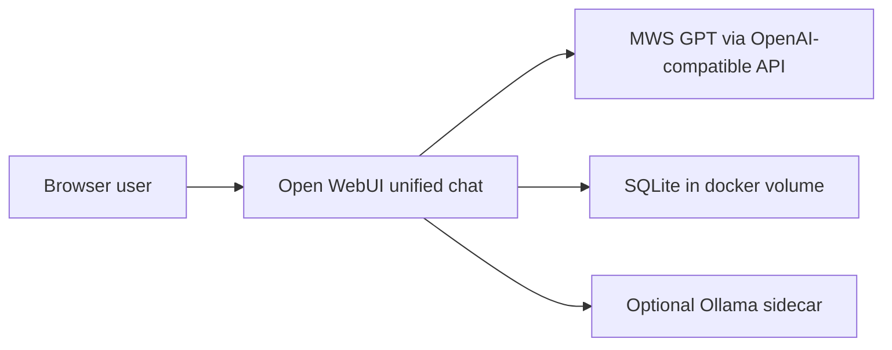

# Architecture

## Goal

Ship a hackathon-ready AI workspace that still behaves like Open WebUI at its core: one primary chat surface, stable auth/session behavior, and pluggable model backends.

## Runtime Topology

## Main Decisions

- The release path defaults to MWS GPT through `OPENAI_API_BASE_URL` and `OPENAI_API_KEY`.
- Open WebUI remains the single user-facing shell, so file, research, memory, and routing features stay inside the existing chat UX.
- Ollama stays available as an optional sidecar for local experiments, but it is disabled by default in `.env.example`.
- Persistence uses the existing `open-webui` volume with SQLite for the shortest path to one-command startup.
- Smoke coverage focuses on app health, auth bootstrap, and landing inside the chat flow.

## One-Command Startup Path

1. Copy `.env.example` to `.env`.
2. Fill in the MWS GPT key and `WEBUI_SECRET_KEY`.
3. Run `make up`.
4. Validate with `make smoke`.

## Release Guardrails

- No business-logic rewrites in agent/domain code without a separate reason.
- No committed secrets; only placeholders in `.env.example`.
- No contract changes were required for this infrastructure/documentation stage, so [docs/CONTRACTS.md](CONTRACTS.md) remains unchanged.
- Manual model choice must remain available even if routing automation is added later.

## CI Shape

- Lint: secret discipline, frontend ESLint, Svelte typecheck, backend Ruff
- Backend tests: targeted pytest smoke
- Frontend smoke: containerized startup plus Cypress landing/login check

## Known Limits

- Full agent-routing semantics are owned by feature teams and are not asserted here.
- End-to-end model-response verification still depends on valid MWS credentials in the target environment.
